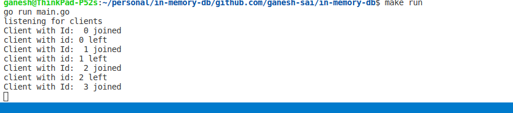
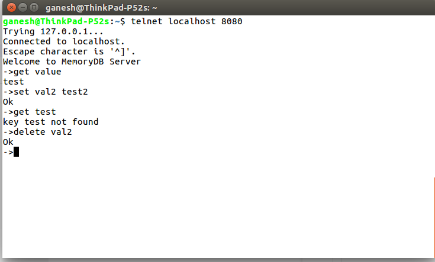

# An in-memory-database

<i>Used to store the key-value pairs. It uses the default the map to store the key value pairs. Under the hood the values are stored in a json file</i>

use the `go run main.go` to start th application

You can connect to the server with a tcp connection on port 8080

